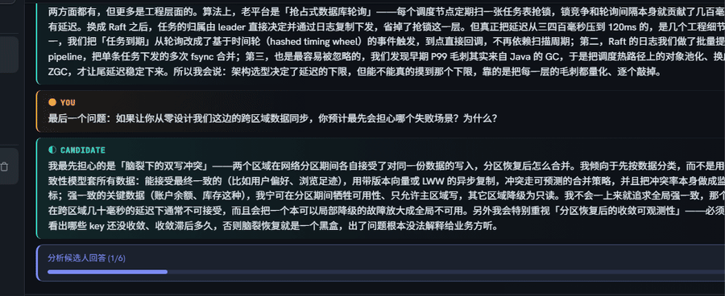
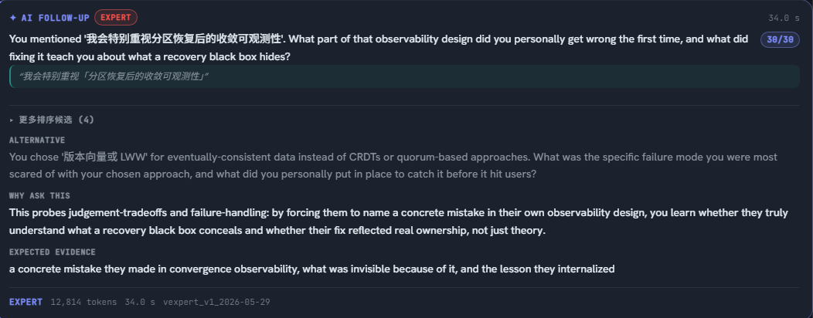
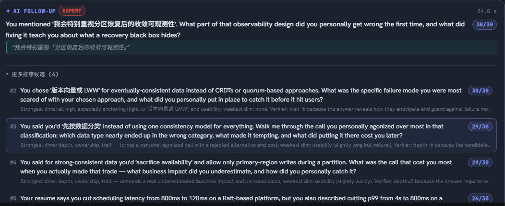
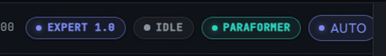
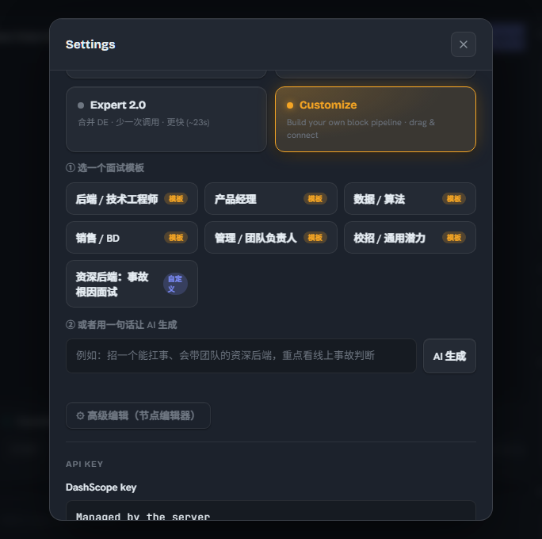
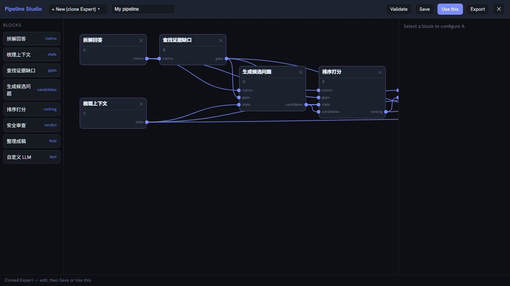
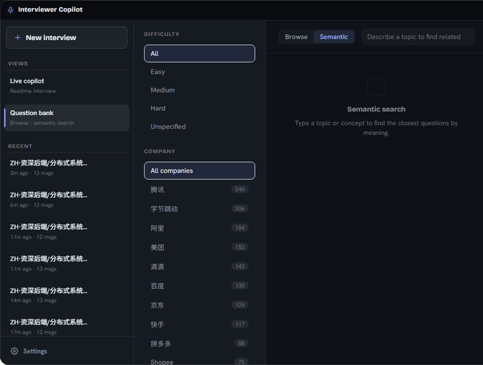
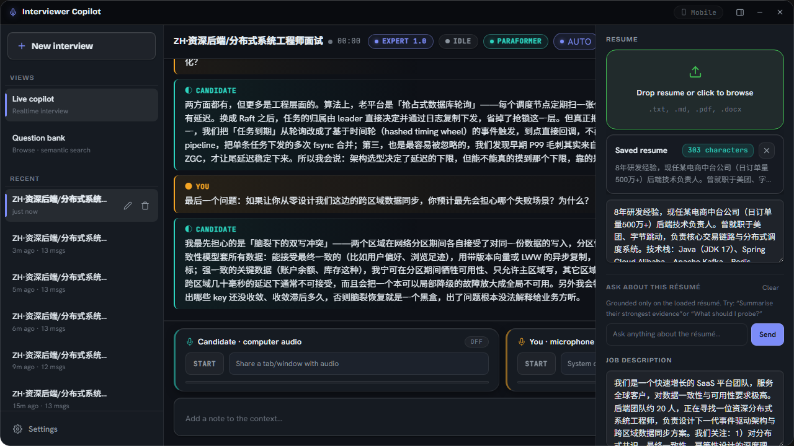

<div align="center">

# Interviewer Copilot

### Your real-time AI partner in the interview room.

**Interviewer Copilot** listens to a live technical interview and, at exactly the right moment,
hands the interviewer the single sharpest follow-up to ask next — scored, ranked, and grounded
in the candidate's own words, the résumé and JD on the table, and a bank of **792 real interview
questions**.

<br />



<br />
<br />

[](https://react.dev)
[](https://www.typescriptlang.org)
[](https://nodejs.org)
[](https://vitejs.dev)
[](https://dashscope.aliyun.com)
[](#license)

</div>

---

## Why Interviewer Copilot

Great interviewing is hard *while you're doing it*. You're listening, taking notes, tracking the
rubric, and trying to think of the one question that turns a rehearsed story into real signal —
all at once. Interviewer Copilot takes the question-design load off your shoulders so you can stay
present with the candidate.

It doesn't answer *for* anyone. It watches the conversation, finds the claim the candidate is
gliding past, and proposes a follow-up that forces specifics — anchored to a phrase they actually
said, scored against a rubric, and backed by a why-ask-this rationale you can trust on the spot.

## How it works

Paste or stream the candidate's latest answer and hit **Generate Q**. A multi-stage pipeline runs
live over a WebSocket, narrating each step with a readable label, a ticking timer, and a rising
token count — then lands a scored, ranked follow-up grounded in the résumé, the JD, and the
question bank.

<div align="center">

</div>

```
 Candidate's answer  ─▶  analyze  ─▶  find the weak point  ─▶  generate candidates
                                                                      │
   Scored follow-up  ◀─  render   ◀─  safety check        ◀─  score & rank
```

Every stage is visible while it runs — `分析候选人回答 → 定位待追问的薄弱点 → 生成候选追问 →
打分与排序 → 合规检查 → 整理追问` — so you always know what the copilot is doing and how long
it will take.

---

## Features

### Live copilot with scored, grounded follow-ups

The hero surface. After each answer, Interviewer Copilot returns the single best follow-up —
quoting a verbatim phrase from the candidate, paired with **why to ask it** and the **evidence it
should surface**. A rubric score (e.g. `30/30`) badges the pick so you know how strong it is before
you open your mouth.

<div align="center">

</div>

### See the runners-up, ranked

The copilot doesn't just give you one option — it scores a whole pool of candidate questions and
ranks them. Expand **更多排序候选** to see the alternatives, each with its own rubric score and a
one-line reason, and promote any of them into the conversation with a click.

<div align="center">

</div>

### Autonomous auto-generation

Flip the **Auto** pill and the copilot fires on its own, watching the live conversation and
surfacing a follow-up the moment the candidate finishes a substantive answer — no clicking required.
Turn it off to stay fully manual. Auto-generated suggestions wear a subtle `自动` badge so you
always know what came from you and what came from the copilot.

<div align="center">

</div>

### Three modes — and a Pipeline Studio to build your own

Pick the depth you want, per interview:

- **Fast** — low-latency two-stage follow-ups for when pace matters.
- **Expert** — a seven-block deep chain (analyze → gap → state → pool → rank → safety → render)
  with independent scoring; the most reliable signal.
- **Customize** — start from a role template (backend, PM, data, sales, manager, new-grad…) or
  describe your panel in one sentence and let the copilot assemble a pipeline for you.

<div align="center">

</div>

Need full control? Open the **Pipeline Studio** — a visual node editor where every block is a node
you can wire together, configure, validate, and save as your own interviewing brain.

<div align="center">

</div>

### A bank of 792 real questions — and RAG grounding everywhere

Browse and **semantically search** 792 deduplicated, real interview questions across 14 companies.
Search by *meaning*, not keywords — type a concept like `分布式锁` and get the closest questions
ranked by relevance, each tagged with company and difficulty.

<div align="center">

</div>

That same bank grounds every generation: before the copilot proposes a follow-up, it retrieves the
most similar real questions and feeds them in as direction hints — so suggestions stay sharp and
on-pattern across **all** modes.

### Résumé & JD grounding

Drop in the candidate's résumé and the job description and the copilot reads them as context for
every follow-up — connecting claims in the answer back to the bullet points on the page and the
priorities of the role. Grounding is additive and stays server-side.

### Live audio (Paraformer / Doubao)

Capture the candidate (shared-tab audio) and yourself (microphone) on separate channels and stream
to a live transcript via pluggable speech-to-text — **Paraformer** (DashScope) or **Doubao**
(Volcengine). The text-driven copilot works with or without it.

---

## Quickstart

You'll need **Node ≥ 20** and a **DashScope API key** (used for both chat and embeddings — it stays
server-side and the browser never sees it).

```bash
cd web-app
cp .env.example .env          # then set DASHSCOPE_API_KEY in .env
npm install                   # installs the workspaces
npm run dev                   # server on :8787 + Vite dev client
```

Open **http://localhost:8787**, start a new interview (try a built-in sample transcript), and hit
**Generate Q**.

### Run it with Docker

One image serves the API, the copilot WebSocket, and the web client. Build from the **repo root**:

```bash
docker build -f web-app/Dockerfile -t interviewer-copilot:latest .
docker run --rm -p 8787:8787 -e DASHSCOPE_API_KEY=sk-xxxx interviewer-copilot:latest
# open http://localhost:8787
```

---

## A quick tour

The whole thing lives in one screen: your conversation in the center, the live copilot output
inline, and the candidate's résumé + JD always in reach.

<div align="center">

</div>

## Architecture

A small npm-workspaces monorepo. One Node process serves the JSON API, the copilot WebSocket
stream, and the React single-page app.

| Workspace | Responsibility |
|---|---|
| `packages/contract` | Shared WS/HTTP protocol — types + constants |
| `packages/copilot-core` | The headless interviewer "brain" (pipeline, prompts, runtime) |
| `packages/question-bank` | Scrape · embed · semantic retriever (+ committed corpus) |
| `server` | Express + `ws` + `zod`: DashScope proxy, copilot WS, question-bank API, serves the SPA |
| `web` | React + TypeScript + Vite client: live copilot, question bank, Pipeline Studio |

The client is **React 18 + TypeScript** built with **Vite**; the server is **Express + WebSocket**.
Hosted AI runs through **Aliyun DashScope** (chat over its Anthropic-shape endpoint;
`text-embedding-v4` for semantic search and RAG). Résumé/JD parsing uses `mammoth` + `pdf-parse`.

For the full developer and deployment guides, see
**[`web-app/README.md`](./web-app/README.md)** and **[`web-app/DEPLOY.md`](./web-app/DEPLOY.md)**.

## License

Released under the MIT License.

---

<div align="center">
<sub>Inspired by Open-Cluely.</sub>
</div>
